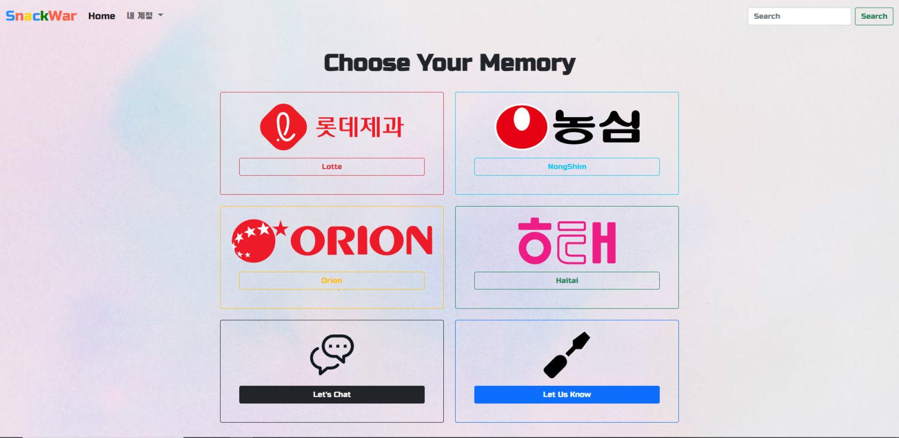
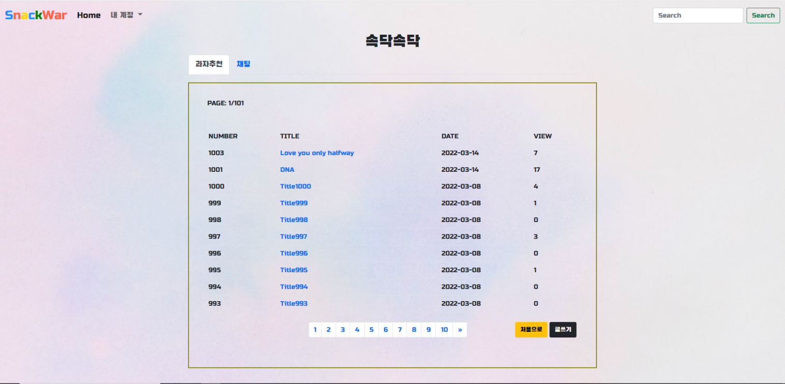
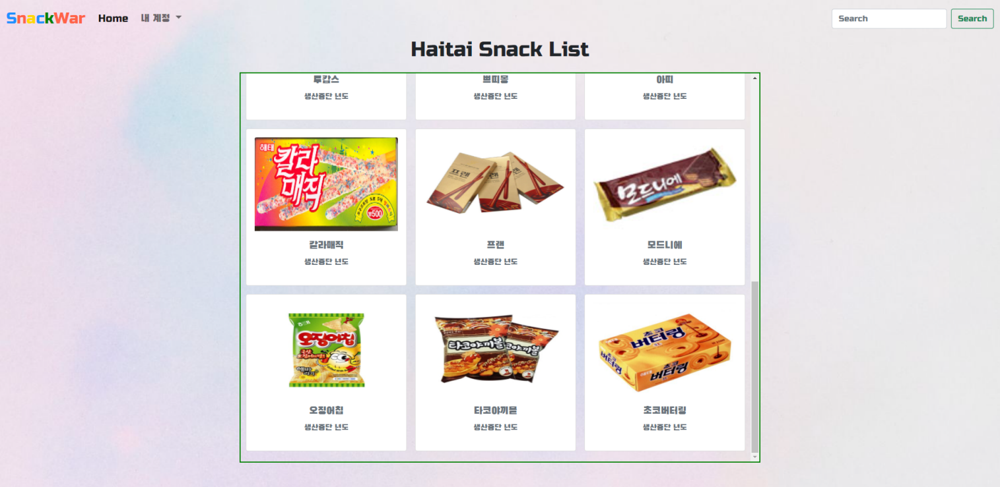
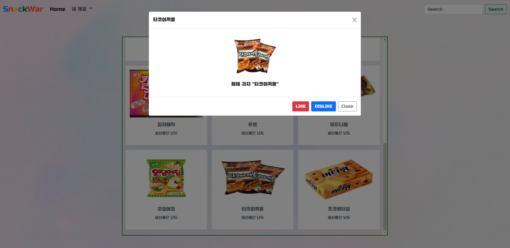

# Snack_War_Project

# Images

# Objective
 ## Korean
- 단종된 과자를 다시금 부활시키려는 프로젝트입니다.
- 제조사별로 유명한 단종 과자를 리스트로 만들어 재출시를 원하는 과자에 "좋아요"를 표시하고
- 일정 수준 이상의 "좋아요"를 받은 과자들을 모아 제조사에 청원서를 제출할 예정입니다.
- 유저들 간의 소통이 가능하기에 다른 다양한 의견을 모아 과자 리스트를 더 추가할 수 있습니다. 
- 해당 웹 사이트에 대한 유저들의 피드백을 받을 수 있고 이를 통해 더 나은 웹사이트가 될 수 있도록 설정했습니다.

 ## English
- This project is about discontinued snacks.
- There are lots of snacks which are discontinued even though they were popular.
- Lots of gimmicks in this page will make them revive as fresh as can be.
- Also, there is a communication page so that we can get your opinions and get some feedbacks.

# Program Stacks
- Java
- HTML/CSS
- JSP/Servlet
- JavaScript
- BootStrap5

# After Work
- 해당 프로젝트를 기획, 구현하는 과정을 통해 프론트엔드와 백엔드 전반에 걸친 역할을 맡을 수 있었습니다.
- 그런 과정을 통해 기본적인 Java 언어에 대한 자신감을 높일 수 있었고, 페이지를 이동하고 또 각각의 페이지를 연결할 때 JSP/Servlet의 중요성도 알 수 있었습니다.
- BootStrap5의 Pagination, Form, Modal을 적극 활용하였고 해당 프레임워크에 대한 이해도도 한층 더 깊어졌습니다.
